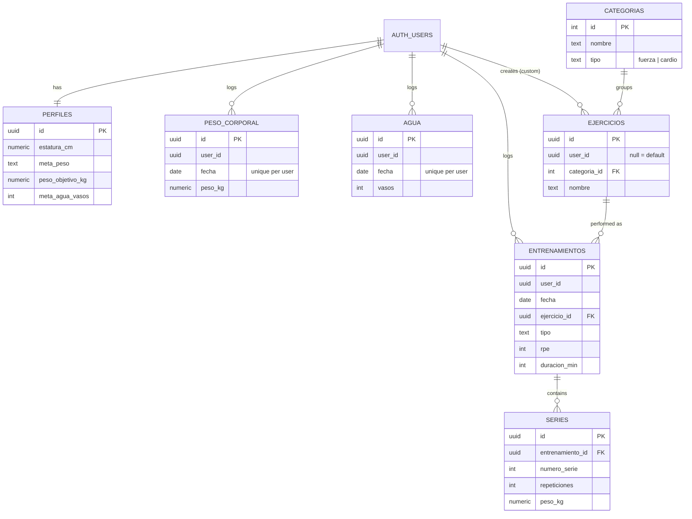

# Steady

**A gym log built for one person: my father.**

Steady is a mobile web app for tracking gym progress: strength sets, body weight, water and cardio. It was designed for a single real user, an older adult who logs his training on his phone between sets. Every decision in the product follows from what he needed, and from what he did not.

**[Open the app](https://olmo-gym.lovable.app)** · **[About](https://olmo-gym.lovable.app/about)** · Use **"Probar la demo"** on the login screen to explore it with sample data. No sign-up needed.

---

## The problem

Most fitness apps are built for people who want training plans, social feeds and coaching. My father wanted three things:

1. Log a set in seconds, with large buttons, in the middle of a workout.
2. See what he lifted last time, so he knows the number to beat.
3. Know whether he is improving.

Steady does those three things and very little else.

## What it does

| Section | Purpose |
|---|---|
| **Medición** (Log) | Record body weight, glasses of water, and exercises. Strength exercises take sets (reps × kg); cardio takes duration and perceived effort (RPE 1–10). |
| **Dashboards** | Training frequency with current and best streak, attendance calendar, body-weight trend, water compliance, weekly cardio minutes, and strength progression per exercise with personal record. |
| **Perfil** (Profile) | Height, weight goal, target weight, daily water goal, current BMI. |

The interface is in Spanish because its first user lives in Medellín, Colombia.

## Design decisions

**Large targets, short flows.** Every tap target is at least 44 px. Adding a glass of water is one tap. Logging a set is two fields.

**"Última vez" (last time) before every set.** When a strength exercise is selected, the app shows the sets from the previous session of that exercise. The target is visible before the lift, not after.

**One entry per day.** Body weight and water are stored once per user per day (`unique (user_id, fecha)` with upsert). Correcting a mistake edits the entry; it never creates a duplicate.

**Private by default.** Row Level Security is enabled on every table and keyed to `auth.uid()`. Default exercises are shared across users (`user_id is null`); exercises a user creates are visible only to that user.

**Installable.** Steady is a PWA with a service worker that caches the app shell, so it opens even when the gym signal is weak.

**A demo that cannot break.** A shared demo account can be modified or locked by any visitor. Instead, "Probar la demo" creates an anonymous Supabase session, and a database function seeds eight weeks of sample data for that session only. A scheduled job deletes anonymous users after 24 hours, and their data is removed by cascade.

## Architecture

- **Frontend:** React, TypeScript, TanStack Start, Tailwind CSS, shadcn/ui, Recharts, Phosphor Icons
- **Backend:** Supabase (Postgres, Auth, Row Level Security, `pg_cron`), hosted on Lovable Cloud
- **Built with:** [Lovable](https://lovable.dev)

### Data model



### Access rules

| Table | Read | Write |
|---|---|---|
| `perfiles` | own row | own row |
| `categorias` | any signed-in user | none (seeded) |
| `ejercicios` | defaults + own | own only |
| `entrenamientos`, `series`, `peso_corporal`, `agua` | own rows | own rows |

A trigger on `auth.users` creates the profile row at sign-up. All schema, policies, seeds and the demo functions are in [`supabase/migrations`](supabase/migrations).

## How it was built

I wrote the product specification: the user, the flows, the data model, the access rules and the acceptance criteria. Lovable's agent generated the implementation from that specification, and I iterated on it from there.

## Known limitations

- Logging requires a connection. The service worker caches the interface, not the data; there is no offline write queue.
- The interface is Spanish only.
- It is designed for one person tracking themselves. There is no sharing, coaching or social layer, by choice.

## Run locally

```sh
git clone https://github.com/santiagocardonao/olmo-gym.git
cd olmo-gym
npm install
npm run dev
```

The app reads `VITE_SUPABASE_URL` and `VITE_SUPABASE_PUBLISHABLE_KEY` from `.env`. To use your own Supabase project, apply the migrations in `supabase/migrations` and enable anonymous sign-ins for the demo.

---

Built by **Santiago Cardona Ortiz** · [GitHub](https://github.com/santiagocardonao) · [LinkedIn](https://www.linkedin.com/in/scardonaortiz)
